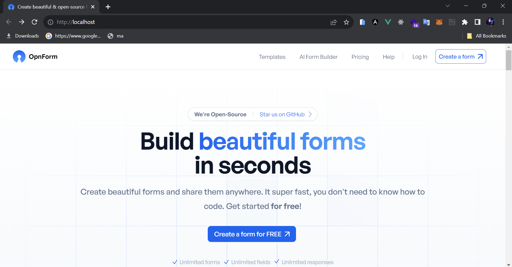

# How to run OpnForm in Local Server

<p align="center">

</p>

### Requirements

- PHP >= 8.0
- MySQL/MariaDB or PostgreSQL
- Node.js and NPM/Yarn/... to compile assets

## Tech Stack
OpnForm is a standard web application built with:
- [Laravel](https://laravel.com/) PHP framework
- [Vue.js](https://vuejs.org/) front-end framework
- [TailwindCSS](https://tailwindcss.com/)

### Docker installation 🐳
1. Install Docker [Docker](https://docs.docker.com/desktop/install/windows-install/)
   - Basically Docker is based on Linux
2. Get the code
   - Clone the project
   
```
https://github.com/beranidigital/form-site-web.git
```

3. cd form-site-web
4. Verify your Docker File
   - Open the sample application in your IDE. Note that it already has a Dockerfile. For your own projects you need to create this yourself.
5. Build your firts Image
   - You can build an image using the following docker build command via a CLI in your project folder.
  
```
docker build -t form-site-web .
```

6. Running from docker hub

```
docker run --name opnform -v $PWD/my-opnform-data:/persist -p 80:80 jhumanj/opnform
```

7. Run your container
   - Once the build is complete, an image will appear in the Images tab. Select the image name to see its details. Select Run to run it as a container. In the Optional settings remember to specify a port number (something like 8080)
8. View the result
   - You now have a running container. If you don't have a name for your container, Docker provides one. View your container live by selecting the link below the container's name.

You should now be able to access the application by visiting  http://localhost in a web browser.


## License
OpnForm is open-source under the GNU Affero General Public License Version 3 (AGPLv3) or any later version. You can find it [here](https://github.com/JhumanJ/OpnForm/blob/main/LICENSE).

